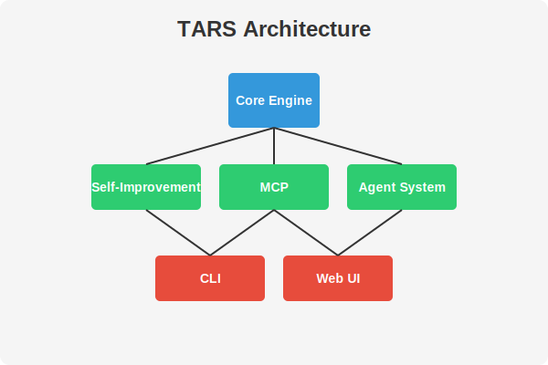
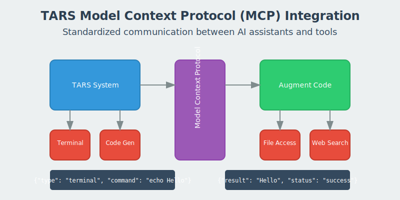

# Built with [Augment Code](https://www.augmentcode.com/)

<div align="center">

## `{"} augment code`
### *The AI pair programmer that knows your codebase*

</div>

> **TARS development has been accelerated by [Augment Code](https://www.augmentcode.com/), an advanced AI pair programming tool.** Augment Code has significantly enhanced our development process through its deep understanding of complex codebases and ability to generate sophisticated implementations. From helping implement F# to Rust transpilation to improving code quality, Augment Code has been an invaluable partner in bringing TARS to life.
>
> *"Augment Code has been transformative for TARS development - from creating a F# to Rust transpiler in record time to implementing autonomous improvement capabilities, MCP integration, and complex DSL features. It's like having an expert developer who already knows your entire codebase."* — Stephane Pareilleux, TARS Creator
>
> [See our collaboration in action](https://app.augmentcode.com/share/bPqtEs7_x4s)

# TARS Project

## MCP and A2A Integration for Agent Collaboration

TARS now features powerful integrations through both the Model Context Protocol (MCP) and the Agent-to-Agent (A2A) protocol:

### MCP Integration

TARS integrates with VSCode Agent Mode and Augment Code through the Model Context Protocol (MCP). This integration enables a seamless collaboration between these three systems, leveraging their respective strengths:

- **TARS**: Provides domain-specific capabilities like metascript processing, DSL handling, and self-improvement
- **VSCode Agent Mode**: Provides the user interface and autonomous agent capabilities within the editor
- **Augment Code**: Offers deep codebase understanding and specialized code generation

The integration is built on the Model Context Protocol (MCP), which enables AI models to interact with external tools and services through a unified interface.

To get started with the MCP integration, see [VS Code Integration](docs/vscode-integration.md) and [Augment VS Code Integration](docs/features/augment-vscode-integration.md).

### A2A Protocol Support

TARS now supports the Agent-to-Agent (A2A) protocol, an open standard developed by Google to enable interoperability between AI agents. This allows TARS to communicate with other A2A-compatible agents and expose its capabilities through a standardized interface.

Key features of the A2A implementation include:

- **Agent Discovery**: Expose TARS capabilities through agent cards
- **Task Submission**: Send and receive tasks between agents
- **Streaming Responses**: Real-time updates during task execution
- **Push Notifications**: Notify agents of task status changes
- **MCP Bridge**: Seamless integration between A2A and MCP

To get started with the A2A protocol, see [A2A Protocol Documentation](docs/A2A-Protocol.md).

<div align="center">
  
</div>

<div align="center">
  <br/>
  
  <br/>
  
  <br/>
  
  <p><i>For more information about these images, see <a href="docs/IMAGES.md">IMAGES.md</a></i></p>
</div>

## Overview

This repository contains the TARS (Transformative Autonomous Reasoning System) project, a powerful AI-driven development and automation system.

## Project Structure

- **TarsEngine** - Core C# engine for system operations
- **TarsEngineFSharp** - F# implementation of core algorithms
- **TarsEngine.Interfaces** - Shared interfaces for system components
- **TarsEngine.SelfImprovement** - F# module for self-improvement capabilities
- **TarsCli** - Command-line interface for interacting with TARS
- **TarsApp** - Main application with UI components
- **TarsCli.Tests** - Test suite for the CLI components
- **Experiments** - Various experimental implementations

## Features

### Project Milestones

TARS is evolving through several key milestones toward full autonomy:

- **Phase 0 (Completed)**: Basic DSL parsing and execution, CLI commands, project structure
- **Phase 1 (In Progress)**: Self-improvement workflow, knowledge extraction from documentation, autonomous improvement capabilities
- **Phase 2 (Planned)**: Full autonomy in self-improvement, advanced reasoning, multi-agent collaboration
- **Phase 3 (Future)**: Domain adaptation, distributed processing, advanced collaboration

See the [detailed milestones](docs/STATUS.md#development-milestones) for a complete timeline and the [current state explanation](docs/CURRENT_STATE.md) for our progress toward full autonomy.

### TARS Metascripts and DSL

TARS includes a powerful Domain Specific Language (DSL) for creating metascripts that orchestrate complex workflows:

- **Metascript Language**: Create scripts that combine multiple AI capabilities
- **Variable Substitution**: Use variables throughout your metascripts
- **Conditional Logic**: Implement IF/ELSE conditions based on results
- **MCP Integration**: Collaborate with other AI systems via MCP
- **Action Types**: Log information, send/receive MCP requests, and more

[View Metascripts documentation](docs/Features/Metascripts.md)

### Model Context Protocol (MCP) Integration with Augment Code

TARS implements Anthropic's Model Context Protocol (MCP), enabling powerful collaboration with [Augment Code](https://www.augmentcode.com/). This integration has been transformative for TARS development, allowing for unprecedented acceleration of complex features. Key capabilities include:

- **Augment Code Collaboration**: Seamless integration with Augment Code for sophisticated code generation and problem-solving
- **Tool-Using Capabilities**: Access and use tools through a standardized protocol
- **Triple-Quoted Syntax**: Use `"""..."""` syntax for multi-line code blocks
- **Terminal Command Execution**: Execute terminal commands with proper authorization
- **Structured Communication**: Standardized JSON format for tool requests and responses
- **Auto-Coding**: Automatic code generation and implementation through Docker containers and swarm architecture
- **Docker Swarm**: Run a swarm of specialized Docker containers for auto-coding

[View Model Context Protocol documentation](docs/features/model-context-protocol.md)

### Learning and Education Features

TARS includes comprehensive learning and education features to help users master new skills:

- **Learning Plans**: Generate personalized learning plans with customizable goals, skill levels, and preferences
- **Course Generation**: Create structured courses with lessons, exercises, quizzes, and assessments
- **Tutorial Organization**: Manage and categorize tutorials with different difficulty levels and prerequisites
- **Demo Mode**: Showcase all TARS capabilities through interactive demonstrations

### Hugging Face Integration

TARS can now browse, download, and install the best coding LLMs from Hugging Face:

- **Model Discovery**: Search and find the best coding models on Hugging Face
- **Automatic Installation**: Download and convert models to work with Ollama
- **Seamless Integration**: Use Hugging Face models with all TARS commands
- **Model Management**: List and manage your installed models
- **GPU Acceleration**: Automatically detect and utilize compatible GPUs for faster inference

[View Hugging Face integration documentation](docs/HUGGINGFACE_INTEGRATION.md)

### Deep Thinking and Exploration

TARS can generate in-depth explorations on complex topics:

- **Topic Exploration**: Generate detailed analyses on any topic
- **Related Topics**: Discover and explore related concepts
- **Version Evolution**: Build on previous explorations to deepen understanding
- **Consolidated Organization**: Explorations are organized by topic for easy reference

### Docker Integration

TARS now supports running LLMs and auto-coding in Docker containers:

- **Containerized Models**: Run LLMs in isolated Docker containers
- **GPU Passthrough**: Utilize GPU acceleration in Docker containers
- **Simplified Deployment**: Easy setup with docker-compose
- **Consistent Environment**: Ensure consistent model behavior across different systems
- **MCP Integration**: Seamless integration with the Model Context Protocol
- **Auto-Coding**: Automatic code generation and improvement through Docker containers
- **Swarm Architecture**: Run a swarm of specialized Docker containers for auto-coding
- **Safe Testing**: Test improvements in isolation before applying them to the codebase

[View Docker Auto-Coding documentation](docs/AutoCoding/README.md)

[View Docker Model Runner documentation](docs/Docker-Model-Runner.md)

### Text-to-Speech Capabilities

TARS now includes text-to-speech functionality:

- **Multiple Voices**: Choose from various voice options
- **Language Support**: Support for multiple languages
- **Voice Cloning**: Clone voices from audio samples
- **Streaming Audio**: Direct audio streaming without intermediate files

### Self-Improvement Capabilities

TARS includes advanced self-improvement capabilities that allow it to analyze, improve, and learn from code and documentation:

#### Current Status (April 2025)

The self-improvement system is currently under active development. Key components include:

- **Workflow Engine**: Framework for executing multi-step improvement workflows
- **Knowledge Extraction**: Capability to extract insights from documentation (in development)
- **Code Analysis**: Identification of improvement opportunities in code
- **Improvement Application**: Application of improvements based on analysis
- **Feedback Collection**: Collection of feedback on applied improvements
- **Learning Database**: System to record improvements and feedback

See the [current status document](docs/STATUS.md) for more details on the project's development progress, the [current state explanation](docs/CURRENT_STATE.md) for a detailed explanation of the current state of TARS and the path to full autonomy, and the [post-mortem analysis](docs/post-mortem/autonomous-improvement-april-2024.md) for an analysis of the autonomous improvement system.

#### Recent Progress

- **Workflow State Management**: Implemented state management for autonomous improvement workflows
- **Enhanced File Prioritization**: Implemented sophisticated file prioritization algorithm that considers file type, content, recency, complexity, and improvement history
- **Improvement Metrics**: Added metrics to measure the quality of improvements and track progress
- **First Analysis Success**: Successfully analyzed test code and identified multiple issues
- **Pattern Recognition**: Implemented detection for magic numbers, inefficient string operations, and more
- **Learning Database**: Created a system to record improvements and feedback
- **JSON Escaping Fix**: Resolved API communication issues with Ollama
- **Console Capture**: Added ability to capture console output and use it to improve code
- **ANSI Escape Sequence Handling**: Improved handling of ANSI escape sequences in console output
- **Self-Improvement Commands**: Added CLI commands for analyzing, improving, generating, and testing code
- **Code Generation**: Implemented code generation based on requirements
- **Test Generation**: Added automatic test generation for code files
- **Improvement Cycle**: Created a complete self-improvement cycle that analyzes and improves code

[View detailed progress tracking](docs/PROGRESS.md) | [Technical documentation](docs/SELF_IMPROVEMENT.md) | [Auto-improvement documentation](docs/features/auto-improvement.md) | [Self-improvement commands](docs/features/self-improvement-commands.md)

#### Core Features

- **Autonomous Improvement**: Run autonomous improvement for a specified time limit
- **Smart File Selection**: Prioritize files based on multiple factors for maximum impact
- **Code Analysis**: Analyze code for potential improvements
- **Improvement Proposals**: Generate proposals for code improvements
- **Self-Rewriting**: Automatically implement approved improvements
- **Learning System**: Track improvement history and learn from past changes
- **Console Output Analysis**: Capture and analyze console output to identify and fix issues
- **Code Generation**: Generate code based on requirements
- **Test Generation**: Generate tests for code files
- **Improvement Cycle**: Run a complete self-improvement cycle on a project

### Retroaction Loop

TARS includes a sophisticated retroaction loop that enables continuous learning from code improvements:

- **Pattern Management**: Maintain a database of improvement patterns with dynamic scores
- **Pattern Application**: Apply patterns to improve code quality
- **Feedback Collection**: Gather data on the effectiveness of improvements
- **Learning Mechanism**: Adjust pattern scores based on feedback
- **Pattern Generation**: Automatically discover new improvement patterns
- **Functional Implementation**: Built with F# using functional programming principles
- **Monadic Abstractions**: Leverages monadic patterns for error handling and state management

[View Retroaction Loop documentation](docs/features/retroaction-loop.md)

### Agent Coordination System

TARS implements a multi-agent coordination system:

- **Agent Roles**: Specialized agents for planning, coding, reviewing, and execution
- **Workflow Engine**: Coordinate multiple agents to complete complex tasks
- **Communication Protocol**: Structured message passing between agents
- **Custom Agent Configurations**: Define custom agent roles and capabilities

### Template System

TARS includes a flexible template system for session management:

- **Session Templates**: Create and manage templates for new sessions
- **Custom Templates**: Define custom templates for specific use cases
- **Variable Substitution**: Use variables in templates for dynamic content

### F# to Rust Transpilation

TARS includes experimental support for transpiling F# code to Rust:

- **Basic Transpilation**: Convert F# functions and types to Rust equivalents
- **Type Mapping**: Automatic mapping of F# types to Rust types
- **Pattern Matching**: Support for translating F# pattern matching to Rust
- **Command-Line Interface**: Simple CLI for transpiling F# files to Rust
- **Example Code**: Built-in examples to demonstrate transpilation capabilities

## Getting Started

### Installation

```bash
# Clone the repository
git clone https://github.com/yourusername/tars.git

# Build the solution
dotnet build

# Run the CLI
dotnet run --project TarsCli/TarsCli.csproj
```

### Basic Usage

```bash
# Initialize a new TARS session
dotnet run --project TarsCli/TarsCli.csproj -- init my-session

# Run a plan in a session
dotnet run --project TarsCli/TarsCli.csproj -- run --session my-session --plan template.fsx

# Analyze a file for improvements
dotnet run --project TarsCli/TarsCli.csproj -- self-improve analyze path/to/file.cs

# Improve a file based on analysis
dotnet run --project TarsCli/TarsCli.csproj -- self-improve improve path/to/file.cs --backup

# Generate code based on requirements
dotnet run --project TarsCli/TarsCli.csproj -- self-improve generate path/to/output.cs --requirements "Create a simple calculator class"

# Generate tests for a file
dotnet run --project TarsCli/TarsCli.csproj -- self-improve test path/to/file.cs --output path/to/tests.cs

# Run a complete self-improvement cycle
dotnet run --project TarsCli/TarsCli.csproj -- self-improve cycle path/to/project --max-files 10 --backup

# Show learning statistics
dotnet run --project TarsCli/TarsCli.csproj -- self-improve stats

# Record feedback on code generation or improvement
dotnet run --project TarsCli/TarsCli.csproj -- self-improve feedback path/to/file.cs --rating 5 --comment "Great improvement!"

# Run autonomous improvement for 60 minutes (legacy command)
dotnet run --project TarsCli/TarsCli.csproj -- auto-improve --time-limit 60 --model llama3

# Run Docker auto-coding
dotnet run --project TarsCli/TarsCli.csproj -- auto-code --docker

# Run Swarm auto-coding
dotnet run --project TarsCli/TarsCli.csproj -- auto-code --swarm

# Check the status of autonomous improvement (legacy command)
dotnet run --project TarsCli/TarsCli.csproj -- auto-improve --status

# Stop autonomous improvement (legacy command)
dotnet run --project TarsCli/TarsCli.csproj -- auto-improve --stop

# Start autonomous improvement workflow on specific directories
dotnet run --project TarsCli/TarsCli.csproj -- auto-improve-workflow --start --directories docs/Explorations/v1/Chats docs/Explorations/Reflections --max-duration 60

# Check the status of the autonomous improvement workflow
dotnet run --project TarsCli/TarsCli.csproj -- auto-improve-workflow --status

# Get a detailed report of the autonomous improvement workflow
dotnet run --project TarsCli/TarsCli.csproj -- auto-improve-workflow --report

# Stop the autonomous improvement workflow
dotnet run --project TarsCli/TarsCli.csproj -- auto-improve-workflow --stop
```

### Model Context Protocol (MCP) Commands

```bash
# Execute a terminal command through MCP
dotnet run --project TarsCli/TarsCli.csproj -- mcp execute "echo Hello, World!"

# Generate code with triple-quoted syntax
dotnet run --project TarsCli/TarsCli.csproj -- mcp code path/to/file.cs -triple-quoted """using System;

public class Program
{
    public static void Main()
    {
        Console.WriteLine(\"Hello, World!\");
    }
}"""

# Start the MCP service for Augment Code integration
dotnet run --project TarsCli/TarsCli.csproj -- mcp start --port 8999

# Configure MCP tool permissions
dotnet run --project TarsCli/TarsCli.csproj -- mcp config --auto-execute true --tools terminal,code,status

# Start the MCP service with Docker Model Runner
dotnet run --project TarsCli/TarsCli.csproj -- mcp start --port 8999 --model-provider DockerModelRunner

# Start the A2A server
dotnet run --project TarsCli/TarsCli.csproj -- a2a start

# Send a task to an A2A agent
dotnet run --project TarsCli/TarsCli.csproj -- a2a send --agent-url "http://localhost:8998/" --message "Generate a C# class for a customer entity" --skill-id "code_generation"

# Get an agent card
dotnet run --project TarsCli/TarsCli.csproj -- a2a get-agent-card --agent-url "http://localhost:8998/"

# Configure Docker Model Runner
dotnet run --project TarsCli/TarsCli.csproj -- docker-model config --base-url http://localhost:8080 --default-model llama3:8b

# Start collaboration between TARS, Augment Code, and VS Code
dotnet run --project TarsCli/TarsCli.csproj -- mcp collaborate start

# Run the Augment VS Code demo
dotnet run --project TarsCli/TarsCli.csproj -- demo augment-vscode-demo --task "Analyze the codebase and suggest improvements"
```

### Multi-Agent Workflows

```bash
# Run a multi-agent workflow for a task
dotnet run --project TarsCli/TarsCli.csproj -- workflow --task "Create a simple web API in C#"
```

### F# to Rust Transpilation

```bash
# Transpile an F# file to Rust
dotnet run --project TarsCli/TarsCli.csproj -- transpile path/to/file.fs path/to/output.rs

# Run a transpilation example
dotnet run --project TarsCli/TarsCli.csproj -- transpile --example
```

### Retroaction Loop

```bash
# Run the retroaction loop
dotnet run --project TarsCli/TarsCli.csproj -- retroaction-loop run

# Create a new pattern
dotnet run --project TarsCli/TarsCli.csproj -- retroaction-loop create-pattern --name "Replace for loop with LINQ" --description "Replace traditional for loops with LINQ expressions" --pattern "for\s*\(int\s+i\s*=\s*0;\s*i\s*<\s*(\w+)\.Count;\s*i\+\+\)\s*{\s*sum\s*\+=\s*\1\[i\];\s*}\s*return\s+sum\s*\/\s*\1\.Count;" --replacement "return $1.Average();" --context "CSharp"

# Apply patterns to a file
dotnet run --project TarsCli/TarsCli.csproj -- retroaction-loop apply --file path/to/file.cs --backup
```

## Development

TARS is designed with a hybrid approach:

- **F#** for core engine components and algorithms
- **C#** for CLI and application interfaces

This combination provides both functional programming benefits and strong integration with .NET ecosystem.

### Recent Build Fixes

We've recently fixed several build errors in the TARS solution related to model class compatibility, service conflicts, and nullability warnings. These fixes include:

- Resolved ambiguous references to IssueSeverity enum
- Fixed property mismatches in CodeIssue, CodeStructure, and other model classes
- Updated enum values in CodeIssueType and MetricType to match the codebase
- Fixed conflicts between TestRunnerService classes in different namespaces
- Resolved nullability warnings in the LoggerAdapter class

See the [build fixes documentation](docs/build-fixes.md) for more details and try the [build fixes demo](docs/demos/Build-Fixes-Demo.md) to learn how these issues were resolved.

### Testing

```bash
# Run the test suite
dotnet test TarsCli.Tests/TarsCli.Tests.csproj
```

### Experimental Features

#### React Three.js with WebGPU Rendering

TARS includes experimental support for WebGPU rendering in React Three.js applications:

- **WebGPU Rendering**: Modern GPU API for high-performance 3D graphics
- **Browser Compatibility Check**: Automatic detection of WebGPU support
- **Fallback Handling**: Graceful degradation when WebGPU is not available
- **Performance Optimization**: Leverages the latest GPU capabilities for improved performance

## Future Directions

- **Plugin System**: Support for custom extensions and third-party integrations
- **Multiple LLM Providers**: Integration with various AI providers
- **Web UI**: Browser-based interface for managing TARS sessions
- **Collaborative Workflows**: Support for multi-user collaboration

## Acknowledgements

### Organizations and Tools
- [Augment Code](https://www.augmentcode.com/) - For providing the revolutionary AI pair programming capabilities that made TARS possible
- [Anthropic](https://www.anthropic.com/) - For the Model Context Protocol specification
- [Ollama](https://ollama.ai/) - For local model inference capabilities
- [Microsoft](https://www.microsoft.com/) - For .NET, C#, F#, and Visual Studio Code
- [Coqui](https://coqui.ai/) - For text-to-speech technology

### Academic and Technical References
- Thomas J. McCabe - For cyclomatic complexity metric (1976)
- Maurice Howard Halstead - For Halstead complexity measures (1977)
- Coleman, Ash, Lowther, and Oman - For the original maintainability index formula
- Microsoft Research - For the modified maintainability index formula
- G. Ann Campbell - For cognitive complexity metric (SonarSource)
- Levenshtein, Vladimir I. - For the Levenshtein distance algorithm used in similarity detection
- Jaccard, Paul - For the Jaccard similarity coefficient used in code comparison
- Markov, Andrey - For Markov chain concepts used in AI components
- Nash, John Forbes - For Nash equilibrium concepts in dynamic systems

### Open Source Projects
- [Roslyn](https://github.com/dotnet/roslyn) - The .NET Compiler Platform for code analysis
- [FSharp.Compiler.Service](https://github.com/fsharp/FSharp.Compiler.Service) - For F# code analysis
- [Microsoft.CodeAnalysis](https://www.nuget.org/packages/Microsoft.CodeAnalysis) - For C# code analysis
- [Three.js](https://threejs.org/) - For 3D visualization capabilities
- [WebGPU](https://www.w3.org/TR/webgpu/) - For GPU acceleration in web applications
- [Docker](https://www.docker.com/) - For containerization and deployment
- [Kubernetes](https://kubernetes.io/) - For container orchestration
- [Redis](https://redis.io/) - For vector storage and caching

## License

This project is licensed under the MIT License - see below for details:

```
MIT License

Copyright (c) 2025 Stephane Pareilleux

Permission is hereby granted, free of charge, to any person obtaining a copy
of this software and associated documentation files (the "Software"), to deal
in the Software without restriction, including without limitation the rights
to use, copy, modify, merge, publish, distribute, sublicense, and/or sell
copies of the Software, and to permit persons to whom the Software is
furnished to do so, subject to the following conditions:

The above copyright notice and this permission notice shall be included in all
copies or substantial portions of the Software.

THE SOFTWARE IS PROVIDED "AS IS", WITHOUT WARRANTY OF ANY KIND, EXPRESS OR
IMPLIED, INCLUDING BUT NOT LIMITED TO THE WARRANTIES OF MERCHANTABILITY,
FITNESS FOR A PARTICULAR PURPOSE AND NONINFRINGEMENT. IN NO EVENT SHALL THE
AUTHORS OR COPYRIGHT HOLDERS BE LIABLE FOR ANY CLAIM, DAMAGES OR OTHER
LIABILITY, WHETHER IN AN ACTION OF CONTRACT, TORT OR OTHERWISE, ARISING FROM,
OUT OF OR IN CONNECTION WITH THE SOFTWARE OR THE USE OR OTHER DEALINGS IN THE
SOFTWARE.
```