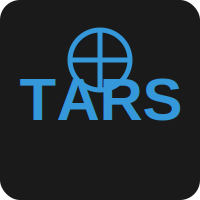
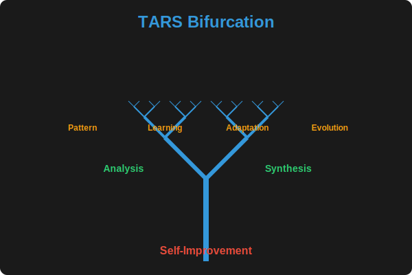

# TARS Project

<div align="center">
  
  <br/>
  
  <br/>
  
  <br/>
  
  <p><i>For more information about these images, see <a href="docs/IMAGES.md">IMAGES.md</a></i></p>
</div>

## Overview

This repository contains the TARS (Transformative Autonomous Reasoning System) project, a powerful AI-driven development and automation system.

## Project Structure

- **TarsEngine** - Core C# engine for system operations
- **TarsEngineFSharp** - F# implementation of core algorithms
- **TarsEngine.Interfaces** - Shared interfaces for system components
- **TarsEngine.SelfImprovement** - F# module for self-improvement capabilities
- **TarsCli** - Command-line interface for interacting with TARS
- **TarsApp** - Main application with UI components
- **TarsCli.Tests** - Test suite for the CLI components
- **Experiments** - Various experimental implementations

## Features

### TARS Metascripts and DSL

TARS includes a powerful Domain Specific Language (DSL) for creating metascripts that orchestrate complex workflows:

- **Metascript Language**: Create scripts that combine multiple AI capabilities
- **Variable Substitution**: Use variables throughout your metascripts
- **Conditional Logic**: Implement IF/ELSE conditions based on results
- **MCP Integration**: Collaborate with other AI systems via MCP
- **Action Types**: Log information, send/receive MCP requests, and more

[View Metascripts documentation](docs/Features/Metascripts.md)

### Model Context Protocol (MCP) Integration

TARS now implements Anthropic's Model Context Protocol (MCP), a standard that enables AI assistants to interact with tools and services. This integration allows TARS to function as an MCP service and collaborate with other MCP-compatible systems like Augment Code. Key features include:

- **Tool-Using Capabilities**: Access and use tools through a standardized protocol
- **Triple-Quoted Syntax**: Use `"""..."""` syntax for multi-line code blocks
- **Terminal Command Execution**: Execute terminal commands with proper authorization
- **Augment Code Integration**: Seamless collaboration with Augment Code through MCP
- **Structured Communication**: Standardized JSON format for tool requests and responses

[View Model Context Protocol documentation](docs/features/model-context-protocol.md)

### Learning and Education Features

TARS includes comprehensive learning and education features to help users master new skills:

- **Learning Plans**: Generate personalized learning plans with customizable goals, skill levels, and preferences
- **Course Generation**: Create structured courses with lessons, exercises, quizzes, and assessments
- **Tutorial Organization**: Manage and categorize tutorials with different difficulty levels and prerequisites
- **Demo Mode**: Showcase all TARS capabilities through interactive demonstrations

### Hugging Face Integration

TARS can now browse, download, and install the best coding LLMs from Hugging Face:

- **Model Discovery**: Search and find the best coding models on Hugging Face
- **Automatic Installation**: Download and convert models to work with Ollama
- **Seamless Integration**: Use Hugging Face models with all TARS commands
- **Model Management**: List and manage your installed models

[View Hugging Face integration documentation](docs/HUGGINGFACE_INTEGRATION.md)

### Deep Thinking and Exploration

TARS can generate in-depth explorations on complex topics:

- **Topic Exploration**: Generate detailed analyses on any topic
- **Related Topics**: Discover and explore related concepts
- **Version Evolution**: Build on previous explorations to deepen understanding
- **Consolidated Organization**: Explorations are organized by topic for easy reference

### Text-to-Speech Capabilities

TARS now includes text-to-speech functionality:

- **Multiple Voices**: Choose from various voice options
- **Language Support**: Support for multiple languages
- **Voice Cloning**: Clone voices from audio samples
- **Streaming Audio**: Direct audio streaming without intermediate files

### Self-Improvement Capabilities

TARS includes advanced self-improvement capabilities that allow it to analyze, improve, and learn from code:

#### Recent Progress

- **Enhanced File Prioritization**: Implemented sophisticated file prioritization algorithm that considers file type, content, recency, complexity, and improvement history
- **Improvement Metrics**: Added metrics to measure the quality of improvements and track progress
- **First Analysis Success**: Successfully analyzed test code and identified multiple issues
- **Pattern Recognition**: Implemented detection for magic numbers, inefficient string operations, and more
- **Learning Database**: Created a system to record improvements and feedback
- **JSON Escaping Fix**: Resolved API communication issues with Ollama
- **Console Capture**: Added ability to capture console output and use it to improve code
- **ANSI Escape Sequence Handling**: Improved handling of ANSI escape sequences in console output
- **Self-Improvement Commands**: Added CLI commands for analyzing, improving, generating, and testing code
- **Code Generation**: Implemented code generation based on requirements
- **Test Generation**: Added automatic test generation for code files
- **Improvement Cycle**: Created a complete self-improvement cycle that analyzes and improves code

[View detailed progress tracking](docs/PROGRESS.md) | [Technical documentation](docs/SELF_IMPROVEMENT.md) | [Auto-improvement documentation](docs/features/auto-improvement.md) | [Self-improvement commands](docs/features/self-improvement-commands.md)

#### Core Features

- **Autonomous Improvement**: Run autonomous improvement for a specified time limit
- **Smart File Selection**: Prioritize files based on multiple factors for maximum impact
- **Code Analysis**: Analyze code for potential improvements
- **Improvement Proposals**: Generate proposals for code improvements
- **Self-Rewriting**: Automatically implement approved improvements
- **Learning System**: Track improvement history and learn from past changes
- **Console Output Analysis**: Capture and analyze console output to identify and fix issues
- **Code Generation**: Generate code based on requirements
- **Test Generation**: Generate tests for code files
- **Improvement Cycle**: Run a complete self-improvement cycle on a project

### Agent Coordination System

TARS implements a multi-agent coordination system:

- **Agent Roles**: Specialized agents for planning, coding, reviewing, and execution
- **Workflow Engine**: Coordinate multiple agents to complete complex tasks
- **Communication Protocol**: Structured message passing between agents
- **Custom Agent Configurations**: Define custom agent roles and capabilities

### Template System

TARS includes a flexible template system for session management:

- **Session Templates**: Create and manage templates for new sessions
- **Custom Templates**: Define custom templates for specific use cases
- **Variable Substitution**: Use variables in templates for dynamic content

## Getting Started

### Installation

```bash
# Clone the repository
git clone https://github.com/yourusername/tars.git

# Build the solution
dotnet build

# Run the CLI
dotnet run --project TarsCli/TarsCli.csproj
```

### Basic Usage

```bash
# Initialize a new TARS session
dotnet run --project TarsCli/TarsCli.csproj -- init my-session

# Run a plan in a session
dotnet run --project TarsCli/TarsCli.csproj -- run --session my-session --plan template.fsx

# Analyze a file for improvements
dotnet run --project TarsCli/TarsCli.csproj -- self-improve analyze path/to/file.cs

# Improve a file based on analysis
dotnet run --project TarsCli/TarsCli.csproj -- self-improve improve path/to/file.cs --backup

# Generate code based on requirements
dotnet run --project TarsCli/TarsCli.csproj -- self-improve generate path/to/output.cs --requirements "Create a simple calculator class"

# Generate tests for a file
dotnet run --project TarsCli/TarsCli.csproj -- self-improve test path/to/file.cs --output path/to/tests.cs

# Run a complete self-improvement cycle
dotnet run --project TarsCli/TarsCli.csproj -- self-improve cycle path/to/project --max-files 10 --backup

# Show learning statistics
dotnet run --project TarsCli/TarsCli.csproj -- self-improve stats

# Record feedback on code generation or improvement
dotnet run --project TarsCli/TarsCli.csproj -- self-improve feedback path/to/file.cs --rating 5 --comment "Great improvement!"

# Run autonomous improvement for 60 minutes (legacy command)
dotnet run --project TarsCli/TarsCli.csproj -- auto-improve --time-limit 60 --model llama3

# Check the status of autonomous improvement (legacy command)
dotnet run --project TarsCli/TarsCli.csproj -- auto-improve --status

# Stop autonomous improvement (legacy command)
dotnet run --project TarsCli/TarsCli.csproj -- auto-improve --stop
```

### Model Context Protocol (MCP) Commands

```bash
# Execute a terminal command through MCP
dotnet run --project TarsCli/TarsCli.csproj -- mcp execute "echo Hello, World!"

# Generate code with triple-quoted syntax
dotnet run --project TarsCli/TarsCli.csproj -- mcp code path/to/file.cs -triple-quoted """using System;

public class Program
{
    public static void Main()
    {
        Console.WriteLine(\"Hello, World!\");
    }
}"""

# Start the MCP service for Augment Code integration
dotnet run --project TarsCli/TarsCli.csproj -- mcp start --port 8999

# Configure MCP tool permissions
dotnet run --project TarsCli/TarsCli.csproj -- mcp config --auto-execute true --tools terminal,code,status
```

### Multi-Agent Workflows

```bash
# Run a multi-agent workflow for a task
dotnet run --project TarsCli/TarsCli.csproj -- workflow --task "Create a simple web API in C#"
```

## Development

TARS is designed with a hybrid approach:

- **F#** for core engine components and algorithms
- **C#** for CLI and application interfaces

This combination provides both functional programming benefits and strong integration with .NET ecosystem.

### Testing

```bash
# Run the test suite
dotnet test TarsCli.Tests/TarsCli.Tests.csproj
```

## Future Directions

- **Plugin System**: Support for custom extensions and third-party integrations
- **Multiple LLM Providers**: Integration with various AI providers
- **Web UI**: Browser-based interface for managing TARS sessions
- **Collaborative Workflows**: Support for multi-user collaboration