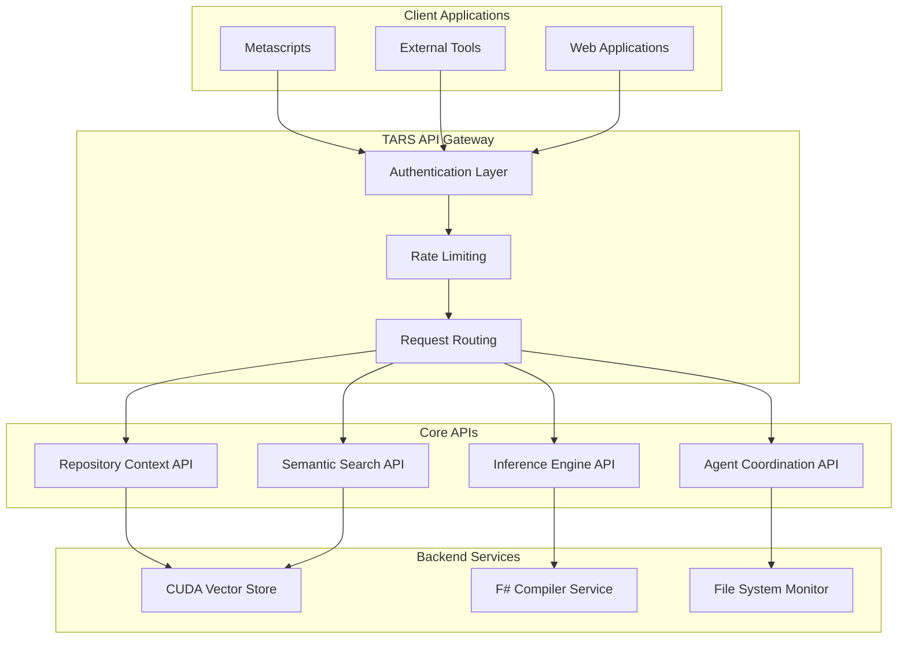

# TARS API Documentation

**Generated:** 2024-12-19 18:45:00  
**Document Type:** API Reference Documentation  
**Classification:** Technical Documentation  
**Format:** Markdown with Code Examples and Diagrams

---

## Table of Contents

1. [API Overview](#1-api-overview)
2. [Authentication & Security](#2-authentication--security)
3. [Repository Context API](#3-repository-context-api)
4. [Semantic Search API](#4-semantic-search-api)
5. [Inference Engine API](#5-inference-engine-api)
6. [Agent Coordination API](#6-agent-coordination-api)
7. [Metascript Execution API](#7-metascript-execution-api)
8. [Performance Monitoring API](#8-performance-monitoring-api)
9. [Error Handling](#9-error-handling)
10. [Code Examples](#10-code-examples)

---

## 1. API Overview

### 1.1 TARS API Architecture



### 1.2 API Endpoints Overview

| API Category | Base URL | Description |
|--------------|----------|-------------|
| **Repository Context** | `/api/v1/repository` | File and repository operations |
| **Semantic Search** | `/api/v1/search` | Vector search and similarity queries |
| **Inference Engine** | `/api/v1/inference` | AI inference and processing |
| **Agent Coordination** | `/api/v1/agents` | Multi-agent task management |
| **Metascript Execution** | `/api/v1/metascripts` | Script execution and management |
| **Performance Monitoring** | `/api/v1/monitoring` | System health and metrics |

## 2. Authentication & Security

### 2.1 API Key Authentication

```http
GET /api/v1/repository/files
Authorization: Bearer YOUR_API_KEY
Content-Type: application/json
```

### 2.2 JWT Token Authentication

```typescript
interface AuthRequest {
  username: string
  password: string
  scope?: string[]
}

interface AuthResponse {
  access_token: string
  token_type: "Bearer"
  expires_in: number
  refresh_token: string
  scope: string[]
}
```

### 2.3 Security Headers

```http
X-API-Version: 1.0
X-Request-ID: uuid-v4
X-Rate-Limit-Remaining: 1000
X-Rate-Limit-Reset: 1640995200
```

## 3. Repository Context API

### 3.1 Get Repository Statistics

```http
GET /api/v1/repository/stats
```

**Response:**
```json
{
  "total_files": 3259,
  "indexed_files": 3259,
  "vector_count": 1729,
  "last_indexed": "2024-12-19T18:30:00Z",
  "file_types": {
    ".fs": 89,
    ".cs": 45,
    ".md": 23,
    ".json": 12
  }
}
```

### 3.2 Search Files

```http
GET /api/v1/repository/files/search?pattern={pattern}&type={file_type}
```

**Parameters:**
- `pattern` (string): Search pattern (supports regex)
- `type` (string): File extension filter
- `limit` (integer): Maximum results (default: 100)
- `offset` (integer): Pagination offset (default: 0)

**Response:**
```json
{
  "files": [
    {
      "path": "TarsEngine.FSharp.Core/AdvancedInferenceEngine.fs",
      "size": 18795,
      "last_modified": "2024-12-19T15:30:00Z",
      "type": "fs",
      "lines": 573
    }
  ],
  "total_count": 89,
  "has_more": true
}
```

### 3.3 Get File Content

```http
GET /api/v1/repository/files/{file_path}/content
```

**Response:**
```json
{
  "path": "TarsEngine.FSharp.Core/AdvancedInferenceEngine.fs",
  "content": "module TarsEngine.FSharp.Core.AdvancedInferenceEngine\n\n...",
  "encoding": "utf-8",
  "size": 18795,
  "lines": 573
}
```

## 4. Semantic Search API

### 4.1 Vector Similarity Search

```http
POST /api/v1/search/similar
Content-Type: application/json
```

**Request:**
```json
{
  "query": "CUDA vector operations",
  "k": 10,
  "threshold": 0.7,
  "include_metadata": true,
  "filters": {
    "file_type": ["fs", "cs"],
    "min_lines": 100
  }
}
```

**Response:**
```json
{
  "results": [
    {
      "id": "vec_12345",
      "score": 0.95,
      "content": "CUDA-accelerated vector operations for high-performance computing...",
      "metadata": {
        "file_path": "TarsEngine.FSharp.Core/CudaVectorStore.fs",
        "line_start": 45,
        "line_end": 67,
        "function_name": "ExecuteVectorOperation"
      }
    }
  ],
  "query_time_ms": 8.7,
  "total_results": 15
}
```

### 4.2 Multi-Modal Search

```http
POST /api/v1/search/multimodal
Content-Type: application/json
```

**Request:**
```json
{
  "inputs": [
    {
      "type": "text",
      "content": "machine learning inference"
    },
    {
      "type": "code",
      "content": "let inference = async { ... }",
      "language": "fsharp"
    }
  ],
  "k": 5,
  "combine_strategy": "weighted_average",
  "weights": [0.7, 0.3]
}
```

### 4.3 Add Vector to Index

```http
POST /api/v1/search/vectors
Content-Type: application/json
```

**Request:**
```json
{
  "vector": [0.1, 0.2, 0.3, ...],
  "metadata": {
    "source": "user_input",
    "content": "Custom vector content",
    "tags": ["custom", "user-generated"]
  }
}
```

## 5. Inference Engine API

### 5.1 Execute Inference

```http
POST /api/v1/inference/execute
Content-Type: application/json
```

**Request:**
```json
{
  "backend": "cuda",
  "input": {
    "type": "text",
    "content": "Analyze this code for potential optimizations"
  },
  "parameters": {
    "max_tokens": 1000,
    "temperature": 0.7,
    "top_p": 0.9
  }
}
```

**Response:**
```json
{
  "result": {
    "output": "The code can be optimized by...",
    "confidence": 0.92,
    "processing_time_ms": 156
  },
  "backend_used": "cuda",
  "performance_metrics": {
    "gpu_utilization": 0.78,
    "memory_usage_mb": 1024,
    "throughput_ops_per_sec": 8500
  }
}
```

### 5.2 Get Available Backends

```http
GET /api/v1/inference/backends
```

**Response:**
```json
{
  "backends": [
    {
      "name": "cuda",
      "status": "available",
      "capabilities": ["text", "code", "embeddings"],
      "performance_tier": "high",
      "memory_usage_mb": 2048
    },
    {
      "name": "neuromorphic",
      "status": "available",
      "capabilities": ["spike_processing", "temporal_patterns"],
      "performance_tier": "specialized",
      "memory_usage_mb": 512
    }
  ]
}
```

### 5.3 Switch Backend

```http
PUT /api/v1/inference/backend
Content-Type: application/json
```

**Request:**
```json
{
  "backend": "neuromorphic",
  "parameters": {
    "spike_threshold": 0.5,
    "temporal_window_ms": 100
  }
}
```

## 6. Agent Coordination API

### 6.1 Create Agent

```http
POST /api/v1/agents
Content-Type: application/json
```

**Request:**
```json
{
  "name": "CodeAnalyzer",
  "type": "analysis",
  "capabilities": ["code_review", "performance_analysis", "security_scan"],
  "configuration": {
    "max_concurrent_tasks": 5,
    "timeout_seconds": 300,
    "priority": "high"
  }
}
```

**Response:**
```json
{
  "agent_id": "agent_12345",
  "name": "CodeAnalyzer",
  "status": "active",
  "created_at": "2024-12-19T18:30:00Z",
  "endpoint": "/api/v1/agents/agent_12345"
}
```

### 6.2 Submit Task to Agent

```http
POST /api/v1/agents/{agent_id}/tasks
Content-Type: application/json
```

**Request:**
```json
{
  "task_type": "code_review",
  "input": {
    "file_path": "TarsEngine.FSharp.Core/AdvancedInferenceEngine.fs",
    "focus_areas": ["performance", "security", "maintainability"]
  },
  "priority": "high",
  "callback_url": "https://your-app.com/webhooks/task-complete"
}
```

### 6.3 Get Agent Status

```http
GET /api/v1/agents/{agent_id}/status
```

**Response:**
```json
{
  "agent_id": "agent_12345",
  "status": "busy",
  "current_tasks": 3,
  "completed_tasks": 157,
  "failed_tasks": 2,
  "average_response_time_ms": 234,
  "last_activity": "2024-12-19T18:29:45Z"
}
```

## 7. Metascript Execution API

### 7.1 Execute Metascript

```http
POST /api/v1/metascripts/execute
Content-Type: application/json
```

**Request:**
```json
{
  "script_content": "TITLE: Test Script\nDESCRIPTION: Test execution\n\nFSHARP {\n  printfn \"Hello TARS!\"\n}",
  "parameters": {
    "timeout_seconds": 300,
    "enable_tracing": true,
    "output_format": "json"
  }
}
```

**Response:**
```json
{
  "execution_id": "exec_12345",
  "status": "completed",
  "output": "Hello TARS!",
  "execution_time_ms": 1234,
  "trace_file": "/traces/exec_12345_trace.yaml",
  "performance_metrics": {
    "memory_peak_mb": 156,
    "cpu_usage_percent": 23.4
  }
}
```

### 7.2 Get Execution Status

```http
GET /api/v1/metascripts/executions/{execution_id}
```

**Response:**
```json
{
  "execution_id": "exec_12345",
  "status": "running",
  "progress": 0.65,
  "started_at": "2024-12-19T18:30:00Z",
  "estimated_completion": "2024-12-19T18:32:30Z",
  "current_step": "F# block execution",
  "output_preview": "Partial output..."
}
```

## 8. Performance Monitoring API

### 8.1 Get System Health

```http
GET /api/v1/monitoring/health
```

**Response:**
```json
{
  "status": "healthy",
  "timestamp": "2024-12-19T18:30:00Z",
  "components": {
    "repository_context": "healthy",
    "vector_store": "healthy",
    "inference_engine": "healthy",
    "agent_coordination": "healthy"
  },
  "metrics": {
    "cpu_usage_percent": 45.2,
    "memory_usage_mb": 2048,
    "disk_usage_percent": 67.3,
    "active_connections": 23
  }
}
```

### 8.2 Get Performance Metrics

```http
GET /api/v1/monitoring/metrics?timeframe=1h&granularity=5m
```

**Response:**
```json
{
  "timeframe": "1h",
  "granularity": "5m",
  "metrics": [
    {
      "timestamp": "2024-12-19T17:30:00Z",
      "requests_per_second": 45.2,
      "average_response_time_ms": 234,
      "error_rate_percent": 0.02,
      "vector_searches_per_second": 12.3
    }
  ]
}
```

## 9. Error Handling

### 9.1 Standard Error Response

```json
{
  "error": {
    "code": "INVALID_REQUEST",
    "message": "The request parameters are invalid",
    "details": {
      "field": "query",
      "reason": "Query string cannot be empty"
    },
    "request_id": "req_12345",
    "timestamp": "2024-12-19T18:30:00Z"
  }
}
```

### 9.2 Error Codes

| Code | HTTP Status | Description |
|------|-------------|-------------|
| `INVALID_REQUEST` | 400 | Request parameters are invalid |
| `UNAUTHORIZED` | 401 | Authentication required |
| `FORBIDDEN` | 403 | Insufficient permissions |
| `NOT_FOUND` | 404 | Resource not found |
| `RATE_LIMITED` | 429 | Too many requests |
| `INTERNAL_ERROR` | 500 | Internal server error |
| `SERVICE_UNAVAILABLE` | 503 | Service temporarily unavailable |

## 10. Code Examples

### 10.1 F# Metascript Example

```fsharp
// Access TARS APIs from within metascripts
let repositoryApi = TarsApi.GetRepositoryContext()
let searchApi = TarsApi.GetSemanticSearch()

// Get repository statistics
let stats = repositoryApi.GetStatistics()
printfn "Repository has %d files with %d vectors" stats.TotalFiles stats.VectorCount

// Perform semantic search
let results = searchApi.SearchSimilar("CUDA operations", 5)
for result in results do
    printfn "Found: %s (score: %.2f)" result.Content result.Score
```

### 10.2 C# Integration Example

```csharp
using TarsEngine.Api;

public class TarsIntegration
{
    private readonly ITarsApiClient _client;
    
    public TarsIntegration(ITarsApiClient client)
    {
        _client = client;
    }
    
    public async Task<SearchResult[]> SearchCodeAsync(string query)
    {
        var request = new SearchRequest
        {
            Query = query,
            K = 10,
            IncludeMetadata = true
        };
        
        return await _client.Search.SimilarAsync(request);
    }
}
```

### 10.3 REST API Example (cURL)

```bash
# Search for similar code
curl -X POST "https://tars-api.example.com/api/v1/search/similar" \
  -H "Authorization: Bearer YOUR_API_KEY" \
  -H "Content-Type: application/json" \
  -d '{
    "query": "machine learning inference",
    "k": 5,
    "threshold": 0.8
  }'

# Execute metascript
curl -X POST "https://tars-api.example.com/api/v1/metascripts/execute" \
  -H "Authorization: Bearer YOUR_API_KEY" \
  -H "Content-Type: application/json" \
  -d '{
    "script_content": "FSHARP { printfn \"Hello from TARS!\" }",
    "parameters": {
      "timeout_seconds": 60
    }
  }'
```

---

## API Rate Limits

| Endpoint Category | Rate Limit | Burst Limit |
|-------------------|------------|-------------|
| **Repository Context** | 1000/hour | 50/minute |
| **Semantic Search** | 500/hour | 25/minute |
| **Inference Engine** | 200/hour | 10/minute |
| **Agent Coordination** | 300/hour | 15/minute |
| **Metascript Execution** | 100/hour | 5/minute |

---

*This API documentation provides comprehensive reference for integrating with TARS system capabilities.*

**Document Classification**: API Documentation  
**Security Level**: Public  
**Distribution**: Developers, Integration Partners  
**Next Review**: Monthly API Updates
