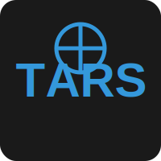

# TARS Project Images
=====================

This document provides information about the images used in the TARS project documentation.

## Logo
--------

The TARS logo represents the core identity of the Transformative Autonomous Reasoning System. The circular design with intersecting lines symbolizes the interconnected nature of the system's components and its ability to process information from multiple sources.

## Architecture
-------------

The architecture diagram illustrates the high-level structure of the TARS system:

### Components

* **Core Engine**: The central component that coordinates all system activities
* **Self-Improvement**: The module responsible for analyzing and enhancing code
* **MCP (Model Context Protocol)**: The standardized protocol for tool interaction and integration
* **Agent System**: The multi-agent coordination system
* **Interfaces**: CLI and Web UI for user interaction

### Information Flow

The connections between components show the flow of information and control within the system.

## Bifurcation
-------------

The bifurcation/fractal image represents the self-improving nature of TARS:

### Self-Improvement Process

* **Analysis**: Examining code for potential improvements
* **Synthesis**: Creating improved versions of the code
* **Pattern Recognition**: Identifying common patterns in code
* **Learning**: Incorporating feedback into the improvement process
* **Adaptation**: Adjusting strategies based on past results
* **Evolution**: The continuous improvement of the system over time

This fractal nature illustrates how small improvements compound over time, leading to significant enhancements in the system's capabilities.

## Model Context Protocol Integration
----------------------------------

The Model Context Protocol (MCP) integration diagram illustrates how TARS implements Anthropic's MCP standard:

### Key Components

* **TARS System**: The core TARS platform that implements the MCP standard
* **Model Context Protocol**: The standardized communication layer between AI assistants and tools
* **Augment Code**: External AI assistant that can collaborate with TARS through MCP
* **Tools**: Various tools that can be accessed through the MCP protocol, including:
  * Terminal command execution
  * Code generation and manipulation
  * File access and management
  * Web search and information retrieval

The diagram shows the bidirectional flow of standardized JSON messages between systems and tools, enabling seamless collaboration between different AI assistants and external services.

## Usage Guidelines
-------------------

When using these images in documentation:

1. Maintain the aspect ratio of the images.
2. Use the SVG versions when possible for better scaling.
3. Include appropriate alt text for accessibility.
4. Credit the TARS project when using these images in external documentation.