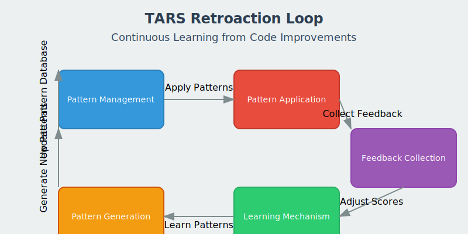

# Retroaction Loop

The Retroaction Loop is a sophisticated system that enables TARS to learn from its own code improvements and continuously enhance its ability to identify and apply effective patterns.

## Overview

The Retroaction Loop is designed to:

1. **Identify Patterns**: Recognize recurring patterns in code that can be improved
2. **Apply Improvements**: Apply these patterns to improve code quality
3. **Collect Feedback**: Gather data on the effectiveness of the improvements
4. **Learn and Adapt**: Adjust pattern scores based on feedback
5. **Generate New Patterns**: Automatically discover new improvement patterns



## Key Components

### Pattern Management

The Retroaction Loop maintains a database of improvement patterns, each with:

- **Pattern**: A regular expression that matches code to be improved
- **Replacement**: The improved code that replaces the matched pattern
- **Context**: The programming language or environment where the pattern applies
- **Score**: A dynamic score that reflects the pattern's effectiveness
- **Usage Statistics**: Data on how often the pattern has been applied and its success rate

### Feedback Collection

The system collects feedback from multiple sources:

- **Runtime Metrics**: Performance changes after applying improvements
- **Code Metrics**: Changes in complexity, maintainability, and other code quality metrics
- **Test Results**: Success or failure of tests after improvements
- **User Feedback**: Explicit feedback from developers

### Learning Mechanism

The Retroaction Loop uses a learning mechanism to:

- **Adjust Pattern Scores**: Increase or decrease pattern scores based on feedback
- **Identify Effective Patterns**: Promote patterns that consistently lead to improvements
- **Deprecate Ineffective Patterns**: Reduce the usage of patterns that don't provide value
- **Generate New Patterns**: Automatically create new patterns based on successful improvements

## Using the Retroaction Loop

### Command Line Interface

The Retroaction Loop can be accessed through the `retroaction-loop` command:

```bash
# Run the retroaction loop
tarscli retroaction-loop run

# Create a new pattern
tarscli retroaction-loop create-pattern --name "Replace for loop with LINQ" --description "Replace traditional for loops with LINQ expressions" --pattern "for\s*\(int\s+i\s*=\s*0;\s*i\s*<\s*(\w+)\.Count;\s*i\+\+\)\s*{\s*sum\s*\+=\s*\1\[i\];\s*}\s*return\s+sum\s*\/\s*\1\.Count;" --replacement "return $1.Average();" --context "CSharp"

# Get statistics about the retroaction loop
tarscli retroaction-loop stats

# Apply patterns to a file
tarscli retroaction-loop apply --file path/to/file.cs --backup
```

### DSL Integration

The Retroaction Loop can also be controlled through TARS DSL metascripts:

```
METASCRIPT "retroaction_example" {
    VARIABLES {
        target_dir: "TarsCli/Services"
        context: "CSharp"
    }

    RETROACTION {
        target: ${target_dir}
        context: ${context}

        PATTERN {
            name: "Replace for loop with LINQ"
            description: "Replace traditional for loops with LINQ expressions"
            pattern: "for\\s*\\(int\\s+i\\s*=\\s*0;\\s*i\\s*<\\s*(\\w+)\\.Count;\\s*i\\+\\+\\)\\s*{\\s*sum\\s*\\+=\\s*\\1\\[i\\];\\s*}\\s*return\\s+sum\\s*\\/\\s*\\1\\.Count;"
            replacement: "return $1.Average();"
            context: "CSharp"
        }

        ACTION {
            type: "analyze"
            files: "${target_dir}/**/*.cs"
        }

        ACTION {
            type: "apply_patterns"
            files: "${target_dir}/**/*.cs"
            backup: true
        }
    }
}
```

## Pattern Examples

### C# Patterns

| Pattern Name | Description | Example Before | Example After |
|--------------|-------------|---------------|--------------|
| Replace for loop with LINQ | Replace traditional for loops with LINQ expressions | `for (int i = 0; i < items.Count; i++) { sum += items[i]; } return sum / items.Count;` | `return items.Average();` |
| Replace null check with null-conditional operator | Replace traditional null checks with null-conditional operators | `if (obj != null) { return obj.Property; } return null;` | `return obj?.Property;` |
| Replace string concatenation with string interpolation | Replace string concatenation with string interpolation | `"Hello, " + name + "!"` | `$"Hello, {name}!"` |

### F# Patterns

| Pattern Name | Description | Example Before | Example After |
|--------------|-------------|---------------|--------------|
| Replace imperative loops with functional approaches | Replace for loops with Array functions | `for i in 0 .. array.Length - 1 do` | `Array.iteri (fun i ->` |
| Replace mutable variables with immutable | Replace mutable variables with immutable when possible | `let mutable x = 1` <br> `x <- 2` | `let x = 1` <br> `let x = 2` |
| Replace explicit recursion with fold | Replace explicit recursion with fold | `let rec sum list = match list with [] -> 0 \| h::t -> h + sum t` | `List.fold (+) 0 list` |

## Benefits

The Retroaction Loop provides several benefits:

1. **Continuous Improvement**: The system gets better over time as it learns from its own actions
2. **Consistency**: Ensures consistent application of best practices across the codebase
3. **Knowledge Capture**: Captures and formalizes improvement patterns that can be shared
4. **Efficiency**: Automates routine code improvements, freeing developers for more complex tasks
5. **Learning**: Provides insights into effective code improvement patterns

## Technical Details

### Implementation

The Retroaction Loop is implemented in F# and C#, with the core pattern matching and learning algorithms in F# for functional programming benefits, and the service and command interfaces in C# for integration with the rest of the TARS system.

The system uses a JSON-based storage format for patterns and feedback, allowing for easy inspection and manual adjustment if needed.

### Functional Programming and Monadic Patterns

The Retroaction Loop leverages functional programming principles and monadic patterns for robust error handling and state management:

- **Result Type**: Uses a discriminated union for success/failure results
- **State Monad**: Manages the RetroactionState through a monadic interface
- **Computation Expressions**: Provides a clean syntax for complex operations
- **Error Handling**: Propagates errors through the monad for consistent handling
- **Immutable Data**: Uses immutable data structures for thread safety

Example of monadic code in the Retroaction Loop:

```fsharp
// Define a monadic operation
let addPatternM pattern = retroaction {
    let! state = getState
    let updatedState = { state with
        Patterns = state.Patterns @ [pattern]
        LastUpdated = DateTime.UtcNow }
    do! setState updatedState
    return pattern.Id
}

// Execute the monadic operation
let result = runState (addPatternM newPattern) initialState
```

## Future Enhancements

Planned enhancements for the Retroaction Loop include:

1. **Machine Learning Integration**: Using machine learning to improve pattern recognition and generation
2. **Cross-Language Pattern Transfer**: Applying patterns learned in one language to similar constructs in other languages
3. **Context-Aware Patterns**: Patterns that consider the broader context of the code, not just local matches
4. **Interactive Pattern Creation**: A UI for creating and testing patterns
5. **Pattern Sharing**: A mechanism for sharing effective patterns between TARS instances
