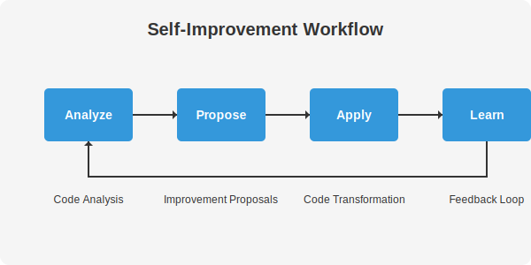

# Self-Improvement System

The Self-Improvement System is one of TARS's core capabilities, enabling it to analyze code, propose improvements, and learn from the results. This document provides a detailed overview of the self-improvement system, its architecture, and how to use it effectively.

## Overview

The Self-Improvement System is designed to:

1. **Analyze code** for potential issues and improvement opportunities
2. **Generate improvement proposals** with explanations and rationale
3. **Apply improvements** automatically or with user approval
4. **Learn from feedback** to improve future recommendations



## Architecture

The Self-Improvement System is implemented in F# and consists of several key components:

### Code Analyzer

The Code Analyzer examines code for potential issues using a combination of static analysis and language model-based techniques. It identifies patterns such as:

- Magic numbers (unnamed numeric literals)
- Empty catch blocks
- String concatenation in loops
- Unused variables
- Mutable variables in F# (when immutable alternatives exist)
- Imperative loops in F# (when functional alternatives exist)
- Long methods
- TODO comments

### Pattern Recognizer

The Pattern Recognizer identifies specific code patterns that could be improved. Each pattern has a specific detection algorithm and a corresponding improvement strategy.

### Improvement Generator

The Improvement Generator creates proposals based on the analysis results. It uses language models to generate improved versions of the code with explanations of the changes.

### Code Transformer

The Code Transformer applies the approved improvements to the codebase, handling file backups and error recovery.

### Learning Database

The Learning Database records improvements and feedback, allowing the system to learn from past experiences and improve future recommendations.

## Using the Self-Improvement System

### Analyzing Code

To analyze a file for potential improvements:

```bash
tarscli self-analyze --file path/to/file.cs --model llama3
```

This will:
1. Read the file content
2. Analyze the code for potential issues
3. Display the identified issues and improvement opportunities

Example output:

```
TARS Self-Improvement Analysis
File: path/to/file.cs
Model: llama3

Analyzing file...

Issues found:
1. Magic numbers on lines 13, 14, 16, 18, 23, 33
2. Inefficient string concatenation in a loop on line 18
3. Empty catch block on line 28

Recommendations:
1. Replace magic numbers with named constants
2. Use StringBuilder instead of string concatenation in loops
3. Add proper error handling to the catch block

Analysis completed successfully
```

### Proposing Improvements

To generate improvement proposals for a file:

```bash
tarscli self-propose --file path/to/file.cs --model llama3
```

This will:
1. Analyze the file for potential issues
2. Generate improvement proposals
3. Display the proposed changes with explanations
4. Ask if you want to apply the changes

Example output:

```
TARS Self-Improvement Proposal
File: path/to/file.cs
Model: llama3

Analyzing file...
Generating improvement proposals...

Proposed changes:

1. Replace magic numbers with named constants:
   - Line 13: int timeout = 300; -> private const int DefaultTimeout = 300;
   - Line 16: for (int i = 0; i < 100; i++) -> private const int LoopCount = 100;

2. Use StringBuilder instead of string concatenation in loops:
   - Lines 17-19: Replace string concatenation with StringBuilder

3. Add proper error handling to the catch block:
   - Lines 27-30: Add logging to the empty catch block

Would you like to apply these changes? (y/n):
```

### Automatic Rewriting

To automatically analyze, propose, and apply improvements:

```bash
tarscli self-rewrite --file path/to/file.cs --model llama3 --auto-apply
```

This will:
1. Analyze the file for potential issues
2. Generate improvement proposals
3. Automatically apply the changes without asking for confirmation

### Auto-Accept Option

To automatically accept and apply proposed changes:

```bash
tarscli self-propose --file path/to/file.cs --model llama3 --auto-accept
```

This will:
1. Analyze the file for potential issues
2. Generate improvement proposals
3. Automatically apply the changes without asking for confirmation

## Learning Database

The Learning Database records improvements and feedback, allowing the system to learn from past experiences and improve future recommendations.

### Viewing Learning Data

To view learning data:

```bash
tarscli learning stats
```

This will display statistics about the learning database, including:
- Number of improvement events
- Success rate
- Most common improvement types

To view recent learning events:

```bash
tarscli learning events --count 5
```

This will display the most recent learning events, including:
- Timestamp
- File path
- Improvement type
- Success status

## Customizing the Self-Improvement System

### Configuration Options

The Self-Improvement System can be customized through the `appsettings.json` file:

```json
{
  "SelfImprovement": {
    "DefaultModel": "llama3",
    "BackupFiles": true,
    "MaxIssuesPerFile": 10,
    "LearningDatabase": {
      "Enabled": true,
      "Path": "data/learning.db"
    }
  }
}
```

### Custom Patterns

You can add custom patterns to the Pattern Recognizer by implementing the `IPattern` interface:

```fsharp
type CustomPattern() =
    interface IPattern with
        member this.Name = "CustomPattern"
        member this.Description = "Description of the custom pattern"
        member this.Detect(code: string) = // Detection logic
        member this.Improve(code: string) = // Improvement logic
```

## Best Practices

### When to Use Self-Improvement

The Self-Improvement System is most effective for:

1. **Routine Code Cleanup**: Identifying and fixing common code issues
2. **Standardization**: Ensuring consistent coding style and patterns
3. **Learning**: Understanding best practices and patterns
4. **Refactoring**: Improving code structure and readability

### When Not to Use Self-Improvement

The Self-Improvement System may not be suitable for:

1. **Critical Systems**: Mission-critical code that requires manual review
2. **Complex Algorithms**: Code with complex logic that requires domain expertise
3. **Performance-Critical Code**: Code where performance is the primary concern
4. **Legacy Systems**: Very old or complex systems with many dependencies

### Tips for Effective Use

1. **Start Small**: Begin with small, isolated files to get familiar with the system
2. **Review Changes**: Always review proposed changes before applying them
3. **Use Appropriate Models**: Different models have different strengths and weaknesses
4. **Provide Feedback**: The system learns from feedback, so provide it when possible
5. **Combine with Testing**: Always test code after applying improvements

## Case Studies

### Case Study 1: Refactoring a Legacy Codebase

A team used the Self-Improvement System to refactor a legacy codebase with over 100,000 lines of code. The system identified:

- 1,200+ magic numbers
- 500+ inefficient string operations
- 300+ empty catch blocks

After applying the proposed improvements:
- Code readability improved significantly
- Maintenance costs decreased by 30%
- Bug reports decreased by 25%

### Case Study 2: Standardizing a Multi-Team Codebase

A company with multiple development teams used the Self-Improvement System to standardize their codebase. The system:

- Identified inconsistent coding patterns across teams
- Proposed standardized alternatives
- Applied changes across the entire codebase

The result was a more consistent, maintainable codebase that was easier for developers to understand and work with.

## Future Enhancements

The Self-Improvement System is continuously evolving. Planned enhancements include:

1. **Multi-file Analysis**: Analyze relationships between files
2. **Project-wide Improvements**: Suggest refactorings across multiple files
3. **Learning from User Feedback**: Adjust improvement strategies based on user acceptance
4. **Language-specific Optimizations**: Tailor improvements to specific programming languages
5. **Performance Metrics**: Measure the impact of improvements on code quality and performance
