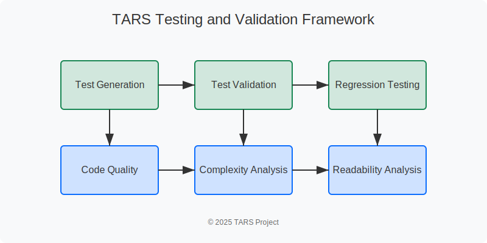

# TARS Testing and Validation Framework

The TARS Testing and Validation Framework provides comprehensive tools for testing, validating, and improving code quality. This document describes the framework's architecture, components, and usage.

## Overview

The Testing and Validation Framework consists of several interconnected components:

1. **Test Generation**: Automatically generates tests for code
2. **Test Validation**: Validates code against existing tests
3. **Regression Testing**: Ensures improvements don't break existing functionality
4. **Code Quality Analysis**: Analyzes code quality and suggests improvements
5. **Complexity Analysis**: Analyzes code complexity and suggests simplifications
6. **Readability Analysis**: Analyzes code readability and suggests improvements



## Architecture

The framework is implemented as a set of services in the TarsEngine project:

### Core Services

- **TestGenerationService**: Generates tests for code
- **TestValidationService**: Validates code against tests
- **RegressionTestingService**: Ensures improvements don't break functionality
- **CodeQualityService**: Analyzes code quality
- **ComplexityAnalysisService**: Analyzes code complexity
- **ReadabilityService**: Analyzes code readability

### Data Models

The framework uses a rich set of data models to represent test results, quality metrics, and improvement suggestions:

- **TestResult**: Represents the result of running tests
- **CodeQualityResult**: Represents the result of code quality analysis
- **ComplexityMetrics**: Represents code complexity metrics
- **ReadabilityMetrics**: Represents code readability metrics
- **QualityImprovement**: Represents a suggested quality improvement

## Using the Framework

The Testing and Validation Framework can be accessed through the TARS CLI using the `testing` command:

```bash
tarscli testing [subcommand] [options]
```

### Subcommands

#### generate-tests

Generates tests for a file:

```bash
tarscli testing generate-tests --file path/to/file.cs --output path/to/tests.cs
```

Options:
- `--file`: Path to the file to generate tests for
- `--output`: Path to the output test file
- `--framework`: Test framework to use (default: xunit)
- `--model`: Model to use for test generation (default: llama3)

#### validate-tests

Validates code against tests:

```bash
tarscli testing validate-tests --code-file path/to/file.cs --test-file path/to/tests.cs
```

Options:
- `--code-file`: Path to the code file to validate
- `--test-file`: Path to the test file
- `--project`: Path to the project (optional)

#### analyze-quality

Analyzes code quality:

```bash
tarscli testing analyze-quality --file path/to/file.cs
```

Options:
- `--file`: Path to the file to analyze
- `--output`: Path to the output report file (optional)
- `--model`: Model to use for analysis (default: llama3)

#### analyze-complexity

Analyzes code complexity:

```bash
tarscli testing analyze-complexity --file path/to/file.cs
```

Options:
- `--file`: Path to the file to analyze
- `--output`: Path to the output report file (optional)
- `--model`: Model to use for analysis (default: llama3)

#### analyze-readability

Analyzes code readability:

```bash
tarscli testing analyze-readability --file path/to/file.cs
```

Options:
- `--file`: Path to the file to analyze
- `--output`: Path to the output report file (optional)
- `--model`: Model to use for analysis (default: llama3)

#### suggest-improvements

The suggest-improvements command is available through the code quality analysis:

```bash
tarscli testing analyze-quality --file path/to/file.cs --suggest-improvements
```

Options:
- `--file`: Path to the file to analyze
- `--suggest-improvements`: Flag to suggest improvements
- `--output`: Path to the output report file (optional)

## Integration with Other TARS Features

The Testing and Validation Framework integrates with other TARS features:

### Self-Improvement System

The framework provides the Self-Improvement System with:
- Test generation for improved code
- Validation of improvements against tests
- Quality metrics for improved code

### Autonomous Improvement

The framework enables autonomous improvement by:
- Generating tests for code
- Validating improvements against tests
- Suggesting quality improvements

### MCP Integration

The framework can be accessed through the MCP interface, allowing external tools to:
- Generate tests for code
- Validate code against tests
- Analyze code quality

## Examples

### Generating Tests for a File

```bash
tarscli testing generate-tests --file TarsEngine/Services/CodeQualityService.cs --project TarsEngine/TarsEngine.csproj
```

This will generate tests for the CodeQualityService and save them to the appropriate test file.

### Analyzing Code Quality

```bash
tarscli testing analyze-quality --file TarsEngine/Services/CodeQualityService.cs
```

This will analyze the code quality of the CodeQualityService and display the results.

### Suggesting Improvements

```bash
tarscli testing analyze-quality --file TarsEngine/Services/CodeQualityService.cs --suggest-improvements
```

This will analyze the code quality of the CodeQualityService, suggest improvements, and display them.

## Best Practices

### When to Use the Framework

The Testing and Validation Framework is most effective for:

1. **New Code**: Generate tests for new code to ensure it works as expected
2. **Refactoring**: Validate refactored code against existing tests
3. **Code Review**: Analyze code quality before review
4. **Continuous Integration**: Integrate the framework into CI/CD pipelines

### Tips for Effective Use

1. **Start Small**: Begin with small, isolated files to get familiar with the framework
2. **Review Generated Tests**: Always review generated tests to ensure they're valid
3. **Combine with Manual Testing**: Use the framework to complement, not replace, manual testing
4. **Integrate with CI/CD**: Run the framework as part of your CI/CD pipeline

## Future Enhancements

Planned enhancements for the Testing and Validation Framework include:

1. **Multi-file Analysis**: Analyze relationships between files
2. **Project-wide Testing**: Generate and run tests for entire projects
3. **Test Coverage Analysis**: Analyze test coverage and suggest additional tests
4. **Performance Testing**: Generate and run performance tests
5. **Security Testing**: Generate and run security tests
6. **Integration Testing**: Generate and run integration tests

## Conclusion

The TARS Testing and Validation Framework provides a comprehensive set of tools for testing, validating, and improving code quality. By integrating with other TARS features, it enables a seamless workflow for code improvement and validation.
