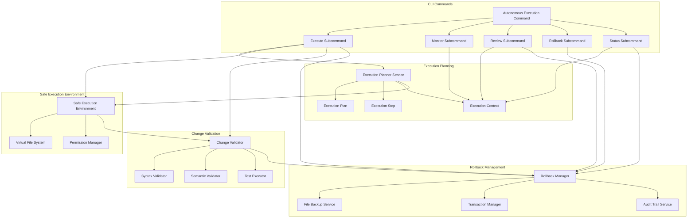

```mermaid
graph TD
    subgraph "CLI Commands"
        CLI[Autonomous Execution Command]
        CLI_E[Execute Subcommand]
        CLI_M[Monitor Subcommand]
        CLI_R[Review Subcommand]
        CLI_RB[Rollback Subcommand]
        CLI_S[Status Subcommand]
        
        CLI --> CLI_E
        CLI --> CLI_M
        CLI --> CLI_R
        CLI --> CLI_RB
        CLI --> CLI_S
    end
    
    subgraph "Execution Planning"
        EP[Execution Planner Service]
        EP_P[Execution Plan]
        EP_S[Execution Step]
        EP_C[Execution Context]
        
        EP --> EP_P
        EP --> EP_S
        EP --> EP_C
    end
    
    subgraph "Safe Execution Environment"
        SEE[Safe Execution Environment]
        VFS[Virtual File System]
        PM[Permission Manager]
        
        SEE --> VFS
        SEE --> PM
    end
    
    subgraph "Change Validation"
        CV[Change Validator]
        SV[Syntax Validator]
        SMV[Semantic Validator]
        TE[Test Executor]
        
        CV --> SV
        CV --> SMV
        CV --> TE
    end
    
    subgraph "Rollback Management"
        RM[Rollback Manager]
        FBS[File Backup Service]
        TM[Transaction Manager]
        ATS[Audit Trail Service]
        
        RM --> FBS
        RM --> TM
        RM --> ATS
    end
    
    CLI_E --> EP
    CLI_E --> SEE
    CLI_E --> CV
    CLI_E --> RM
    
    CLI_M --> EP_C
    
    CLI_R --> EP_C
    CLI_R --> RM
    
    CLI_RB --> RM
    
    CLI_S --> EP_C
    CLI_S --> RM
    
    EP --> SEE
    SEE --> CV
    CV --> RM
```
