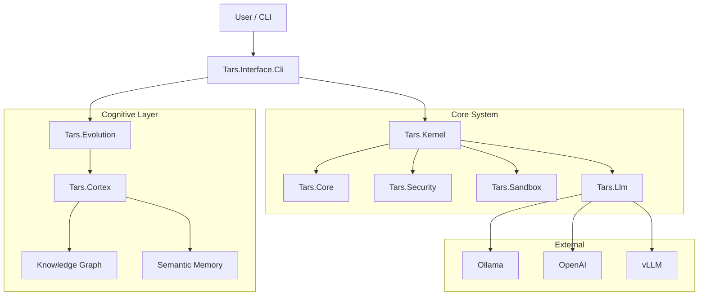

# TARS Architecture



## ASCII Representation
```

       +----------------+       +----------------+
       |   User / CLI   | ----> | Tars.Interface |
       +----------------+       +-------+--------+
                                        |
                                        v
       +--------------------------------------------------+
       |                   Tars.Kernel                    |
       |  (Agent Registry, Message Bus, Tool Execution)   |
       +------------------------+-------------------------+
                                |
          +---------------------+---------------------+
          |                     |                     |
          v                     v                     v
  +--------------+      +--------------+      +--------------+
  | Tars.Cortex  |      | Tars.Evolution|     |   Tars.Llm   |
  | (Cognitive)  |      | (Self-Imp.)   |     | (Connectors) |
  +------+-------+      +-------+------+      +-------+------+
         |                      |                     |
         v                      v                     v
  +--------------+      +--------------+      +--------------+
  |  Knowledge   |      |   Metascript  |     | External APIs|
  |    Graph     |      |   (Workflow)  |     | (Ollama/AI)  |
  +--------------+      +--------------+      +--------------+
        
```